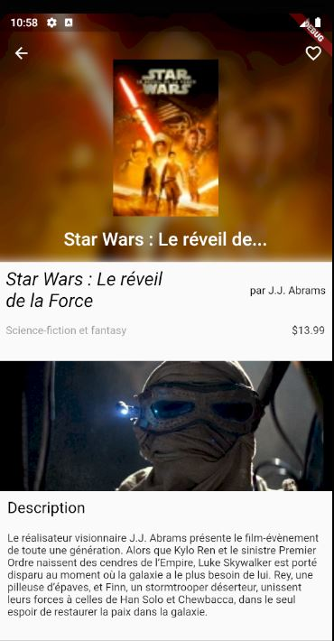

# itunes_api_search

A simple Flutter app that displays content of itunes based on user search.

## Prerequisites

* Any Operating System (ie. MacOS X, Linux, Windows)
* Any IDE with Flutter SDK installed (ie. IntelliJ, Android Studio, VSCode etc)
* A little knowledge of Dart and Flutter

## Getting Started

These instructions will get you a copy of the project up and running on your local machine for development and testing purposes. See deployment for notes on how to deploy the project on a live system.

```bash
git clone https://github.com/Xsims/itunes_api_search.git
cd projectName
flutter run
```

## ScreenShots


## Deployment

Mobile operating systems: Android Jelly Bean, v16, 4.1.x or newer, and iOS 8 or newer.

Mobile hardware: iOS devices (iPhone 4S or newer) and ARM Android devices.

Note [Flutter](https://flutter.io/faq/#what-devices-and-os-versions-does-flutter-run-on) currently does not support building for x86 Android (issue #9253) directly, however apps built for ARMv7 or ARM64 run fine (via ARM emulation) on many x86 Android devices.

## Built With

* [Flutter SDK](https://flutter.dev/docs/get-started/install) - The cross-platform framework
* [Dart](https://dart.dev/) - Programming language
* [Android Studio IDE](https://developer.android.com/studio/) - IDE from JetBrains and Google, with Dart and Flutter plugins.

## Authors

* **Simon Grangier** - *Initial work* - [Xsims](https://github.com/Xsims)

## License

This project is licensed under the MIT License - see the [LICENSE.md](LICENSE.md) file for details

## Acknowledgments

* [Successful Git branching model](https://nvie.com/posts/a-successful-git-branching-model/)
* [Fetching Data with Flutter](https://flutter.dev/docs/cookbook/networking/fetch-data)
* [Json to Dart](https://javiercbk.github.io/json_to_dart/)
